# ADR-016: Flux for GitOps Continuous Delivery

## Status
**Accepted**

## Date
2026-01-07

## Context

Talent Mesh needs a deployment strategy for the K3s cluster on Contabo VPS. Options considered:

1. **Manual kubectl/helm**: Simple but no audit trail, error-prone
2. **CI/CD only (GitHub Actions)**: Push-based, no drift detection
3. **ArgoCD**: Full-featured GitOps with UI, but 500-800MB overhead
4. **Flux**: Lightweight GitOps, Kubernetes-native, ~200MB overhead

Key constraints:
- **Limited resources**: 24GB RAM total across 3 nodes
- **Small team**: 1-2 developers, "vibe coding" approach
- **MVP focus**: Need to minimize infrastructure overhead
- **Zero-cost preference**: No additional services

## Decision

We will use **Flux v2** for GitOps continuous delivery.

### Why Flux Over ArgoCD

| Factor | Flux | ArgoCD |
|--------|------|--------|
| Memory overhead | **~200MB** | ~500-800MB |
| CPU overhead | **~50m** | ~100m |
| Kubernetes-native | **Yes** (CRDs) | Partial |
| UI | None (CLI) | Built-in |
| Learning curve | **Lower** | Higher |
| SOPS integration | **Native** | Plugin required |

### Flux Components

```mermaid
flowchart TB
    subgraph git["Git Repository"]
        manifests["K8s Manifests<br/>/k8s/clusters/contabo-europe"]
        helm_releases["HelmRelease CRDs"]
        kustomizations["Kustomization CRDs"]
    end

    subgraph flux["Flux Controllers (~200MB total)"]
        source["source-controller<br/>(~64MB)"]
        kustomize["kustomize-controller<br/>(~64MB)"]
        helm["helm-controller<br/>(~64MB)"]
        notification["notification-controller<br/>(~32MB)"]
    end

    subgraph cluster["K3s Cluster"]
        apps["Application Pods"]
        secrets["Secrets (via SOPS)"]
    end

    git -->|Pull| source
    source --> kustomize
    source --> helm
    kustomize -->|Apply| apps
    helm -->|Apply| apps
    kustomize -->|Decrypt| secrets
    notification -->|Alerts| webhook["Discord/Slack"]
```



### Repository Structure

```
talent-mesh/
├── k8s/
│   ├── clusters/
│   │   └── contabo-europe/           # Cluster-specific config
│   │       ├── flux-system/          # Flux bootstrap
│   │       ├── infrastructure.yaml   # Infrastructure Kustomization
│   │       └── apps.yaml             # Apps Kustomization
│   ├── infrastructure/
│   │   ├── sources/                  # HelmRepository definitions
│   │   ├── istio/                    # Istio Ambient config
│   │   ├── databases/                # PostgreSQL, MongoDB, Redis
│   │   └── monitoring/               # Prometheus, Grafana (future)
│   └── apps/
│       ├── base/                     # Base manifests
│       │   ├── auth-service/
│       │   ├── user-service/
│       │   └── ...
│       └── overlays/
│           └── production/           # Production overrides
└── .sops.yaml                        # SOPS configuration
```

### Flux + SOPS Integration

Flux natively supports SOPS decryption:

```yaml
# k8s/clusters/contabo-europe/flux-system/gotk-sync.yaml
apiVersion: kustomize.toolkit.fluxcd.io/v1
kind: Kustomization
metadata:
  name: apps
  namespace: flux-system
spec:
  interval: 10m
  path: ./k8s/apps/overlays/production
  prune: true
  sourceRef:
    kind: GitRepository
    name: flux-system
  decryption:
    provider: sops
    secretRef:
      name: sops-age  # Age private key
```

### Bootstrap Command

```bash
# Install Flux CLI
curl -s https://fluxcd.io/install.sh | sudo bash

# Bootstrap Flux to cluster
flux bootstrap github \
  --owner=talent-mesh \
  --repository=platform \
  --branch=main \
  --path=k8s/clusters/contabo-europe \
  --personal

# Import SOPS age key for decryption
cat ~/.config/sops/age/keys.txt | kubectl create secret generic sops-age \
  --namespace=flux-system \
  --from-file=age.agekey=/dev/stdin
```

### Sync Intervals

| Resource Type | Interval | Rationale |
|---------------|----------|-----------|
| GitRepository | 1m | Fast detection of changes |
| HelmRepository | 10m | Helm charts change rarely |
| Kustomization | 10m | Balance between responsiveness and load |
| HelmRelease | 10m | Same as Kustomization |

## Consequences

### Positive

1. **Low overhead**: ~200MB RAM vs 500-800MB for ArgoCD
2. **Kubernetes-native**: Uses standard CRDs, no custom API server
3. **Native SOPS support**: Seamless secret decryption
4. **Audit trail**: All changes tracked in git
5. **Self-healing**: Drift detection and auto-correction
6. **No UI overhead**: CLI-based fits "vibe coding" workflow

### Negative

1. **No built-in UI**: Must use CLI or add Weave GitOps (~100MB extra)
2. **Less visual**: Harder to see deployment status at a glance
3. **Learning curve**: Team must learn Flux CRDs

### Mitigations

- Use `flux get all` for status overview
- Consider Weave GitOps UI later if needed (~100MB)
- Document common Flux commands in runbook

## Resource Budget

| Component | Memory | CPU |
|-----------|--------|-----|
| source-controller | 64MB | 10m |
| kustomize-controller | 64MB | 20m |
| helm-controller | 64MB | 10m |
| notification-controller | 32MB | 5m |
| **Total** | **~224MB** | **~45m** |

This fits comfortably within our resource constraints.

## Alternatives Considered

### ArgoCD
- **Pros**: Built-in UI, more features, larger community
- **Cons**: 500-800MB overhead, more complex
- **Rejected**: Resource overhead too high for MVP

### GitHub Actions Only (No GitOps)
- **Pros**: Zero cluster overhead, simple
- **Cons**: No drift detection, no self-healing, push-based
- **Rejected**: Want GitOps benefits from day 1

### Manual Deployments
- **Pros**: Simplest, full control
- **Cons**: Error-prone, no audit trail, not scalable
- **Rejected**: Not suitable for production

## Useful Commands

```bash
# Check Flux status
flux get all

# Reconcile immediately (don't wait for interval)
flux reconcile kustomization apps

# View logs
flux logs --all-namespaces

# Suspend/resume deployments
flux suspend kustomization apps
flux resume kustomization apps

# Check SOPS decryption
flux get kustomization apps -o yaml | grep -A5 decryption
```

## References

- [Flux Documentation](https://fluxcd.io/docs/)
- [Flux SOPS Integration](https://fluxcd.io/docs/guides/mozilla-sops/)
- [ADR-013: Secrets with SOPS + ESO](./ADR-013-SECRETS-SOPS-ESO.md)
- [ADR-014: Contabo VPS Infrastructure](./ADR-014-CONTABO-VPS-INFRASTRUCTURE.md)

---

*ADR Version: 1.0*
*Last Updated: 2026-01-07*
