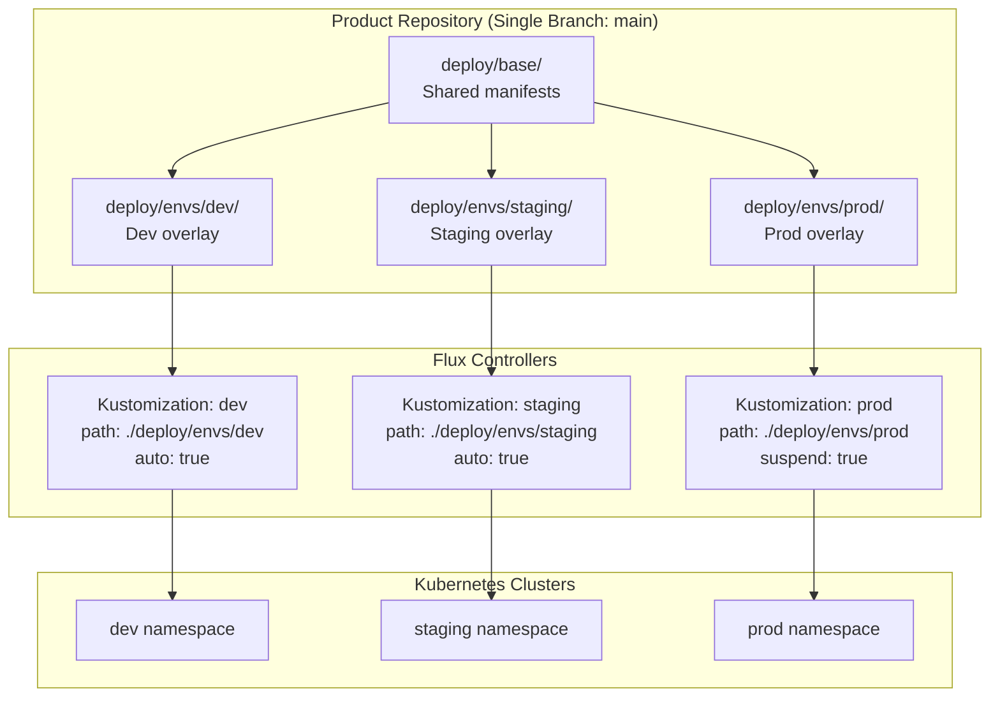
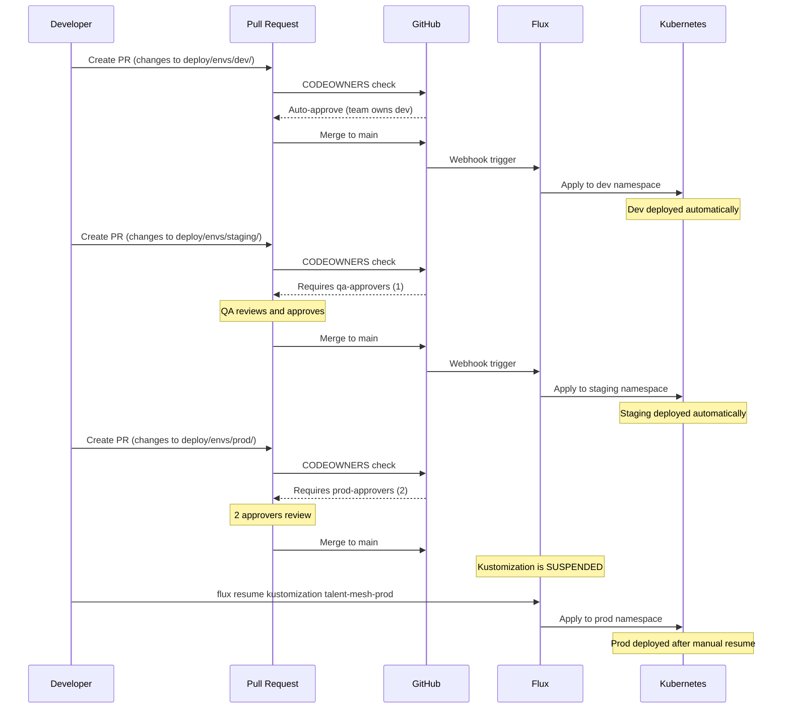

# ADR-041: GitOps Release Management with Folder-per-Environment

## Status
**Accepted**

## Date
2026-01-09

## Context

OpenOva needs a GitOps release management strategy that enables:

- **Maximum team autonomy** - Teams deploy independently without SRE tickets
- **Environment isolation** - Dev, staging, prod with different approval requirements
- **DRY configuration** - Share base manifests across environments
- **Progressive delivery** - Changes flow dev → staging → prod
- **Audit trail** - All changes tracked in git

Options evaluated:
1. **Branch-per-environment**: dev, staging, main branches - **REJECTED (anti-pattern)**
2. **Separate repos per environment**: gitops-dev, gitops-staging, gitops-prod - **REJECTED (violates autonomy)**
3. **Folder-per-environment**: Single branch, folders for environments - **SELECTED**

### Why Branch-per-Environment is an Anti-Pattern

Industry consensus (Codefresh, Cloudogu, Flux documentation):

- **Merge conflicts**: Constant cherry-picking/rebasing between branches
- **Drift**: Environments diverge over time
- **No atomic commits**: Hard to track "this change" across environments
- **CI/CD complexity**: Separate pipelines per branch

## Decision

We will use **folder-per-environment** on a single branch (main) with **CODEOWNERS** for approval gates.

### Architecture



### Approval Model via CODEOWNERS

```gitignore
# CODEOWNERS - Different approval requirements per path

# Base changes require SAME approval as prod
# (changes affect all environments)
/deploy/base/           @openova/prod-approvers

# Dev - team self-approve (0 external approvals)
/deploy/envs/dev/       @openova/talent-mesh-team

# Staging - QA approval (1 approval)
/deploy/envs/staging/   @openova/qa-approvers

# Prod - 2 prod approvers required
/deploy/envs/prod/      @openova/prod-approvers
```

### GitHub Branch Protection Rules

```yaml
# Repository Settings → Branches → main

Require pull request before merging: true
Required approving reviews: 1  # Minimum (CODEOWNERS enforces per-path)
Require CODEOWNERS review: true
Require status checks:
  - ci/build
  - ci/test
  - trivy/scan
Require branches to be up to date: true
```

### GitHub Environments for Deployment Gates

```yaml
# GitHub Settings → Environments

environments:
  dev:
    deployment_branch_policy:
      protected_branches: true
    # No reviewers - auto-deploy

  staging:
    deployment_branch_policy:
      protected_branches: true
    reviewers:
      - openova/qa-approvers  # 1 reviewer
    wait_timer: 0

  prod:
    deployment_branch_policy:
      protected_branches: true
    reviewers:
      - openova/prod-approvers  # 2 reviewers required
    wait_timer: 5  # 5-minute delay for last-minute abort
```

### Flux Kustomizations

```yaml
# Dev - auto-sync enabled
apiVersion: kustomize.toolkit.fluxcd.io/v1
kind: Kustomization
metadata:
  name: talent-mesh-dev
  namespace: flux-system
spec:
  interval: 5m
  path: ./deploy/envs/dev
  prune: true
  sourceRef:
    kind: GitRepository
    name: talent-mesh
  targetNamespace: talent-mesh-dev

---
# Staging - auto-sync enabled
apiVersion: kustomize.toolkit.fluxcd.io/v1
kind: Kustomization
metadata:
  name: talent-mesh-staging
  namespace: flux-system
spec:
  interval: 10m
  path: ./deploy/envs/staging
  prune: true
  sourceRef:
    kind: GitRepository
    name: talent-mesh
  targetNamespace: talent-mesh-staging

---
# Prod - SUSPENDED by default (manual resume after approval)
apiVersion: kustomize.toolkit.fluxcd.io/v1
kind: Kustomization
metadata:
  name: talent-mesh-prod
  namespace: flux-system
spec:
  interval: 10m
  path: ./deploy/envs/prod
  prune: true
  suspend: true  # Won't auto-deploy!
  sourceRef:
    kind: GitRepository
    name: talent-mesh
  targetNamespace: talent-mesh-prod
```

### Release Workflow



### Kustomize Overlay Example

```yaml
# deploy/base/kustomization.yaml
apiVersion: kustomize.config.k8s.io/v1beta1
kind: Kustomization
resources:
  - namespace.yaml
  - deployment.yaml
  - service.yaml
  - configmap.yaml

---
# deploy/envs/dev/kustomization.yaml
apiVersion: kustomize.config.k8s.io/v1beta1
kind: Kustomization
resources:
  - ../../base
namePrefix: dev-
commonLabels:
  env: dev
patches:
  - patch: |
      - op: replace
        path: /spec/replicas
        value: 1
    target:
      kind: Deployment

---
# deploy/envs/prod/kustomization.yaml
apiVersion: kustomize.config.k8s.io/v1beta1
kind: Kustomization
resources:
  - ../../base
namePrefix: prod-
commonLabels:
  env: prod
patches:
  - patch: |
      - op: replace
        path: /spec/replicas
        value: 3
    target:
      kind: Deployment
```

### Base Changes Require Prod-Level Approval

**Critical rule**: Changes to `deploy/base/` affect ALL environments.

Therefore, base changes require the same approval as prod (2 approvers):

```gitignore
# In CODEOWNERS
/deploy/base/           @openova/prod-approvers
```

This ensures:
- No accidental changes to prod via base modifications
- All environments get the same tested configuration
- Base changes are reviewed with production mindset

## Consequences

### Positive

1. **Industry standard**: Folder-per-environment is the recommended pattern
2. **DRY**: Single base, environment-specific overlays
3. **Atomic commits**: One PR = one change across intended environments
4. **Clear audit trail**: Git history shows exactly what changed where
5. **Team autonomy**: CODEOWNERS enables self-service for dev
6. **Progressive delivery**: Natural flow from dev → staging → prod

### Negative

1. **Single branch complexity**: Large PRs can touch multiple environments
2. **Learning curve**: Team must understand Kustomize overlays
3. **Manual prod gate**: Flux suspend requires manual resume

### Mitigations

- **PR templates**: Guide developers on which paths to change
- **CI checks**: Validate Kustomize builds for all environments
- **Documentation**: Clear runbook for prod deployments

## Implementation

### CI Pipeline Validation

```yaml
# .github/workflows/ci.yaml
name: CI
on:
  pull_request:
    paths:
      - 'deploy/**'

jobs:
  validate:
    runs-on: ubuntu-latest
    steps:
      - uses: actions/checkout@v4

      - name: Validate Kustomize (all environments)
        run: |
          for env in dev staging prod; do
            echo "Validating $env..."
            kustomize build deploy/envs/$env > /dev/null
          done

      - name: Check for base changes
        run: |
          if git diff --name-only origin/main | grep -q "^deploy/base/"; then
            echo "::warning::Base changes detected - requires prod-level approval"
          fi
```

### Prod Deployment Workflow

```yaml
# .github/workflows/cd-prod.yaml
name: Deploy to Prod
on:
  push:
    branches: [main]
    paths:
      - 'deploy/envs/prod/**'

jobs:
  deploy:
    runs-on: ubuntu-latest
    environment: prod  # Triggers GitHub Environment approval
    steps:
      - name: Resume Flux Kustomization
        run: |
          flux resume kustomization talent-mesh-prod

      - name: Wait for reconciliation
        run: |
          flux reconcile kustomization talent-mesh-prod --with-source
          flux get kustomization talent-mesh-prod

      - name: Suspend again (safety)
        run: |
          flux suspend kustomization talent-mesh-prod
```

## References

- [Flux Kustomization](https://fluxcd.io/docs/components/kustomize/kustomization/)
- [Kustomize Best Practices](https://kubectl.docs.kubernetes.io/guides/config_management/)
- [GitHub CODEOWNERS](https://docs.github.com/en/repositories/managing-your-repositorys-settings-and-features/customizing-your-repository/about-code-owners)
- [GitHub Environments](https://docs.github.com/en/actions/deployment/targeting-different-environments/using-environments-for-deployment)
- [Codefresh: Stop Using Branches for Environments](https://codefresh.io/blog/stop-using-branches-deploying-different-gitops-environments/)
- [Cloudogu: GitOps Patterns](https://cloudogu.com/en/blog/gitops-repository-patterns)
- [ADR-016: Flux GitOps](/docs/09-adrs/ADR-016-FLUX-GITOPS.md)
- [ADR-040: Repository Structure](/docs/09-adrs/ADR-040-REPOSITORY-STRUCTURE.md)

---

*ADR Version: 1.0*
*Last Updated: 2026-01-09*
