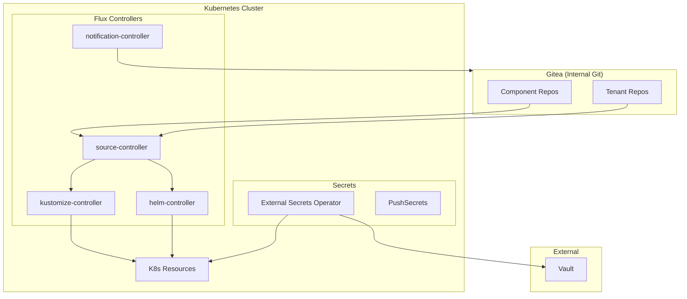
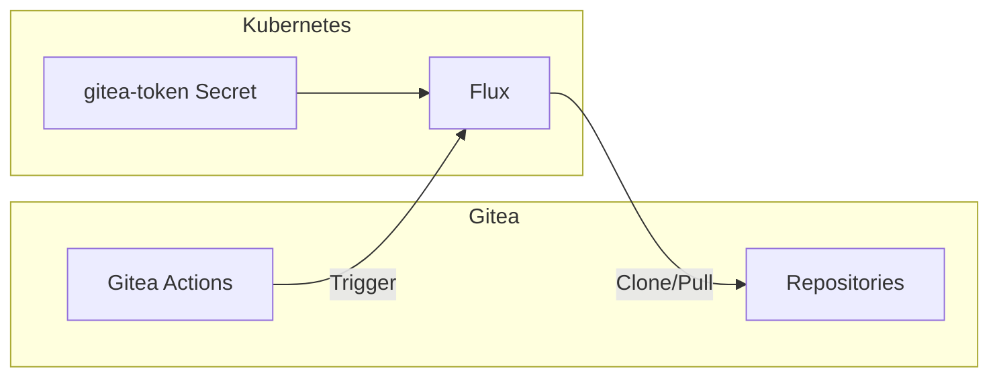
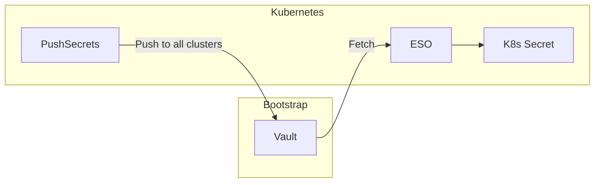
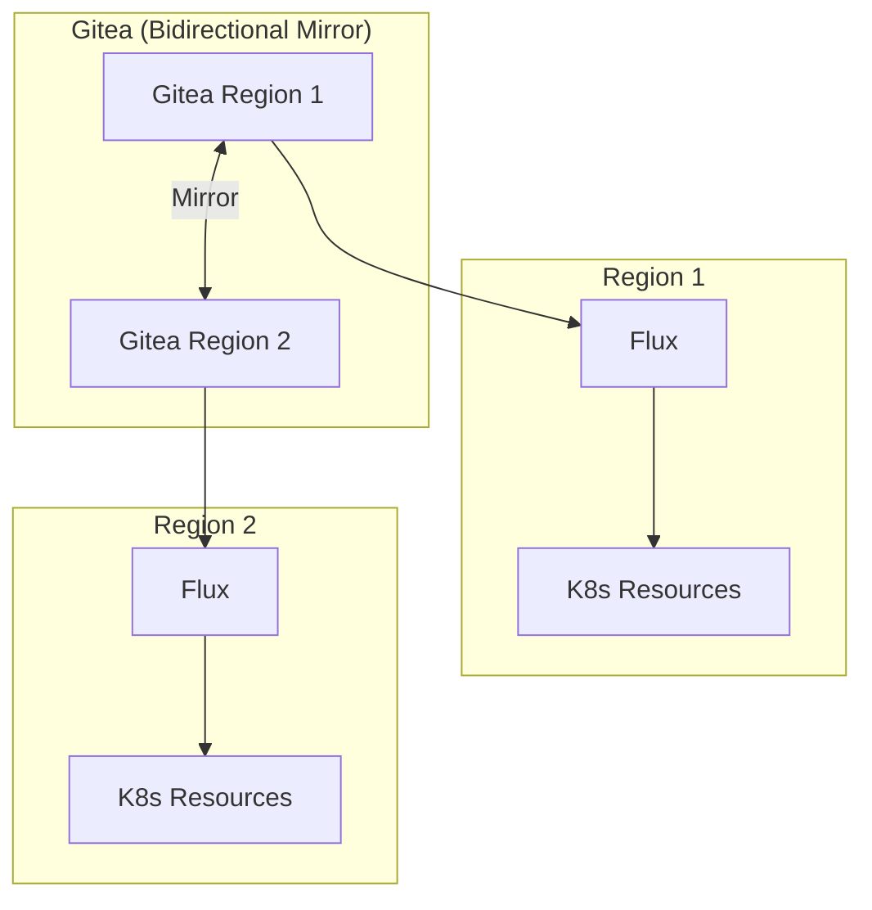

# ADR: Flux GitOps

**Status:** Accepted
**Date:** 2024-05-01
**Updated:** 2026-01-17

## Context

Need a GitOps delivery mechanism for Kubernetes. Options: Flux, ArgoCD, or manual kubectl.

## Decision

Use **Flux** as the GitOps delivery engine with **Gitea** as the internal Git provider and External Secrets Operator for secrets management.

## Architecture



## Rationale

| Factor | Flux | ArgoCD |
|--------|------|--------|
| Memory overhead | ~200MB | ~500-800MB |
| Architecture | Kubernetes-native CRDs | Separate UI/API |
| Secrets | Via ESO (PushSecrets) | Via ESO (PushSecrets) |
| CLI workflow | Excellent | UI-focused |

**Key Decision Factors:**
- Lower resource overhead
- CLI-focused fits single-developer workflow
- Kubernetes-native CRDs
- Works well with External Secrets Operator
- Integrates seamlessly with Gitea

## Components

| Controller | Memory | Purpose |
|------------|--------|---------|
| source-controller | 64MB | Git/Helm repo sync |
| kustomize-controller | 64MB | Kustomization apply |
| helm-controller | 64MB | HelmRelease management |
| notification-controller | 32MB | Alerts |

## Gitea Integration

Flux connects to Gitea repositories using Gitea access tokens:



### Gitea Token Secret

Created during bootstrap and stored via ESO:

```yaml
apiVersion: v1
kind: Secret
metadata:
  name: gitea-token
  namespace: flux-system
type: Opaque
data:
  username: Zm... # base64 encoded
  password: Z2l... # base64 encoded (Gitea access token)
```

### GitRepository for Gitea

```yaml
apiVersion: source.toolkit.fluxcd.io/v1
kind: GitRepository
metadata:
  name: <component>
  namespace: flux-system
spec:
  interval: 5m
  url: https://gitea.<domain>/<org>/<component>.git
  ref:
    branch: main
  secretRef:
    name: gitea-token
```

## Secrets Management

**Important:** Flux uses External Secrets Operator (ESO) with PushSecrets pattern:



- **No SOPS**: SOPS has been eliminated from the architecture
- **PushSecrets**: 100% PushSecrets pattern for multi-region
- **K8s Secrets as source of truth**: Apps read from K8s Secrets only

See [ADR-SECRETS-MANAGEMENT](../../external-secrets/docs/ADR-SECRETS-MANAGEMENT.md) for details.

## Configuration

### Kustomization

```yaml
apiVersion: kustomize.toolkit.fluxcd.io/v1
kind: Kustomization
metadata:
  name: <component>
  namespace: flux-system
spec:
  interval: 10m
  targetNamespace: <namespace>
  sourceRef:
    kind: GitRepository
    name: <component>
  path: ./manifests
  prune: true
  healthChecks:
    - apiVersion: apps/v1
      kind: Deployment
      name: <component>
      namespace: <namespace>
```

## Multi-Region GitOps



- Each region has its own Flux installation
- Both Gitea instances mirror repositories bidirectionally
- Flux in each region pulls from local Gitea
- Region-specific configuration handled via Kustomize overlays

## Gitea Actions Integration

Gitea Actions can trigger Flux reconciliation:

```yaml
# .gitea/workflows/notify-flux.yaml
name: Notify Flux
on:
  push:
    branches: [main]

jobs:
  notify:
    runs-on: ubuntu-latest
    steps:
      - name: Trigger Flux reconciliation
        run: |
          curl -X POST \
            -H "Authorization: Bearer ${{ secrets.FLUX_WEBHOOK_TOKEN }}" \
            https://flux-webhook.<domain>/hook/...
```

## Consequences

**Positive:**
- Low overhead (~200MB)
- K8s-native CRDs
- CLI-focused
- Works with ESO PushSecrets
- Seamless Gitea integration
- Self-hosted Git (no external dependency)

**Negative:**
- No GUI (use Grafana dashboards)
- Learning curve for Flux resources

## Related

- [ADR-GITEA](../../gitea/docs/ADR-GITEA.md)
- [ADR-SECRETS-MANAGEMENT](../../external-secrets/docs/ADR-SECRETS-MANAGEMENT.md)
- [ADR-GITOPS-RELEASE-MANAGEMENT](./ADR-GITOPS-RELEASE-MANAGEMENT.md)
- [SPEC-FLUX-STRUCTURE](./SPEC-FLUX-STRUCTURE.md)
