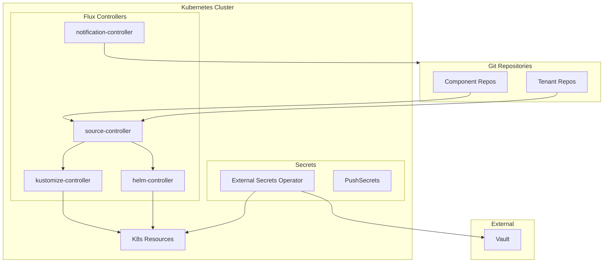
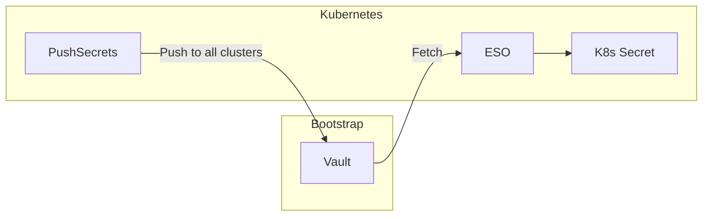
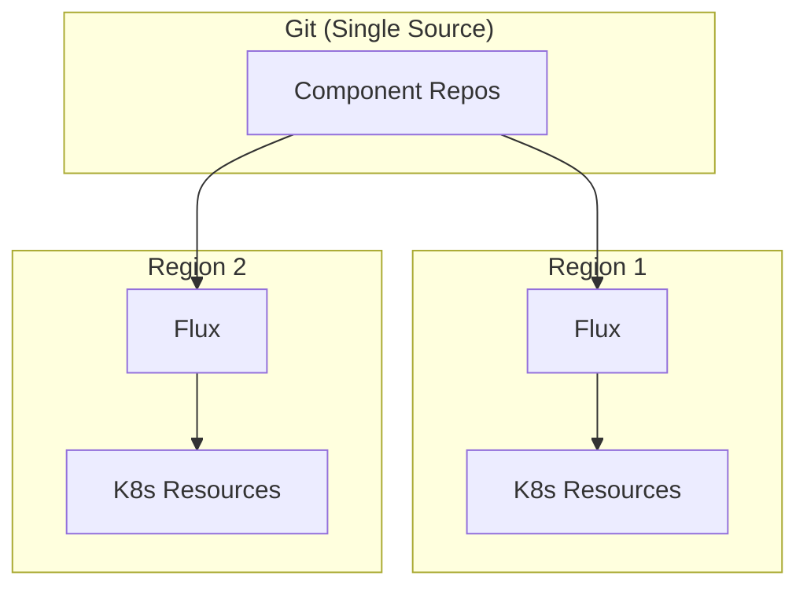

# ADR: Flux GitOps

**Status:** Accepted
**Date:** 2024-05-01
**Updated:** 2026-01-16

## Context

Need a GitOps delivery mechanism for Kubernetes. Options: Flux, ArgoCD, or manual kubectl.

## Decision

Use **Flux** as the GitOps delivery engine with External Secrets Operator for secrets management.

## Architecture



## Rationale

| Factor | Flux | ArgoCD |
|--------|------|--------|
| Memory overhead | ~200MB | ~500-800MB |
| Architecture | Kubernetes-native CRDs | Separate UI/API |
| Secrets | Via ESO (PushSecrets) | Via ESO (PushSecrets) |
| CLI workflow | Excellent | UI-focused |

**Key Decision Factors:**
- Lower resource overhead
- CLI-focused fits single-developer workflow
- Kubernetes-native CRDs
- Works well with External Secrets Operator

## Components

| Controller | Memory | Purpose |
|------------|--------|---------|
| source-controller | 64MB | Git/Helm repo sync |
| kustomize-controller | 64MB | Kustomization apply |
| helm-controller | 64MB | HelmRelease management |
| notification-controller | 32MB | Alerts |

## Secrets Management

**Important:** Flux uses External Secrets Operator (ESO) with PushSecrets pattern:



- **No SOPS**: SOPS has been eliminated from the architecture
- **PushSecrets**: 100% PushSecrets pattern for multi-region
- **K8s Secrets as source of truth**: Apps read from K8s Secrets only

See [ADR-SECRETS-MANAGEMENT](../../external-secrets/docs/ADR-SECRETS-MANAGEMENT.md) for details.

## Configuration

### GitRepository

```yaml
apiVersion: source.toolkit.fluxcd.io/v1
kind: GitRepository
metadata:
  name: <component>
  namespace: flux-system
spec:
  interval: 5m
  url: https://github.com/openova-io/<component>
  ref:
    branch: main
  secretRef:
    name: github-token
```

### Kustomization

```yaml
apiVersion: kustomize.toolkit.fluxcd.io/v1
kind: Kustomization
metadata:
  name: <component>
  namespace: flux-system
spec:
  interval: 10m
  targetNamespace: <namespace>
  sourceRef:
    kind: GitRepository
    name: <component>
  path: ./manifests
  prune: true
  healthChecks:
    - apiVersion: apps/v1
      kind: Deployment
      name: <component>
      namespace: <namespace>
```

## Multi-Region GitOps



Each region has its own Flux installation, all pointing to the same Git repositories. Region-specific configuration handled via Kustomize overlays.

## Consequences

**Positive:**
- Low overhead (~200MB)
- K8s-native CRDs
- CLI-focused
- Works with ESO PushSecrets

**Negative:**
- No GUI (use Grafana dashboards)
- Learning curve for Flux resources

## Related

- [ADR-SECRETS-MANAGEMENT](../../external-secrets/docs/ADR-SECRETS-MANAGEMENT.md)
- [ADR-GITOPS-RELEASE-MANAGEMENT](./ADR-GITOPS-RELEASE-MANAGEMENT.md)
- [SPEC-FLUX-STRUCTURE](./SPEC-FLUX-STRUCTURE.md)
